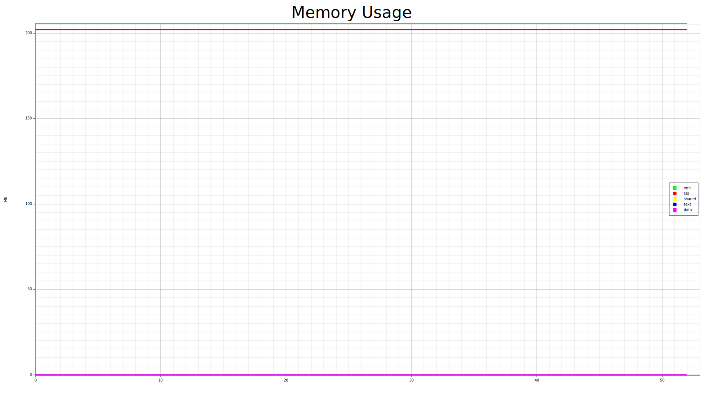
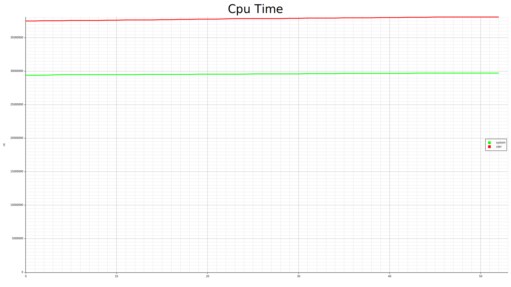
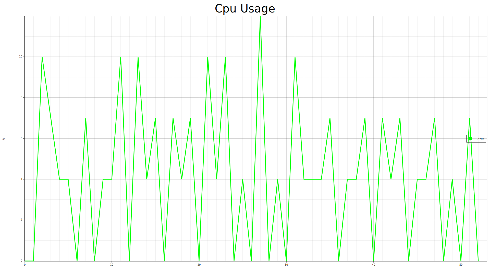
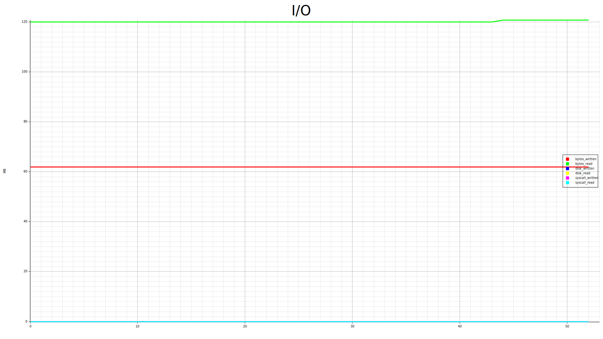

# clairvoyance
process resource monitoring tool

A process resource monitoring tool that can collect the memory, cpu and other resource usage of the specified process and draw a graph.

一个进程资源监视工具, 可以收集指定进程的内存, cpu等等资源的使用并且绘制成图表.

## platform
linux/windows/macos

depends on [heim#platform-support](https://github.com/heim-rs/heim#platform-support)

## build
```shell
cargo +nightly build --release
```

## usage
### record
#### help
```shell
clairvoyance record help
```
#### example
Record the specified process at a frequency of 600ms, and output the result to the result directory:
```shell
clairvoyance record -f 600ms -o result <pid> [<pid>]...
```
`ctrl+c` stops you should notice a file `result/<pid>-<time>.clairvoyance`.

### render
#### help
```shell
clairvoyance render help
```
#### example
Render the specified intermediate file into an icon, the targets include memory(-m), cpu(-c), io(-i), and output the image generated by rendering to the `result/out` directory.
```shell
clairvoyance render -o result/out -m -c -i result/<pid>-<time>.clairvoyance
```

#### custom rendering
Use the -j option to convert the intermediate file to json format, which you can then read and render yourself.
```shell
clairvoyance render -o result/out -j result/<pid>-<time>.clairvoyance
```
example: [result.json](examples/result.json)

the specific format can refer to: [data.rs](src/data.rs)

## example





---
This project relies on [heim](https://github.com/heim-rs/heim) to collect process information on specific platforms.
